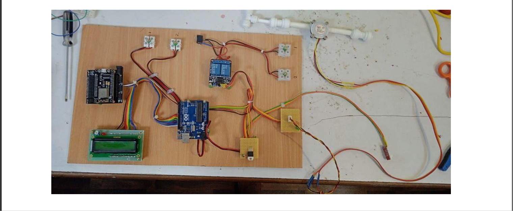
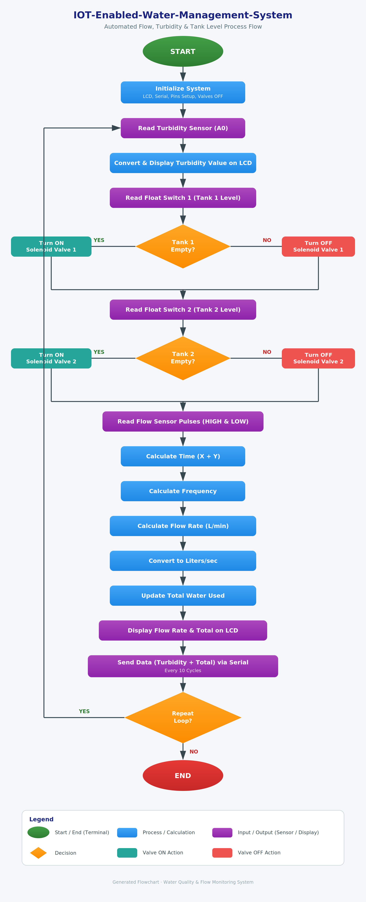
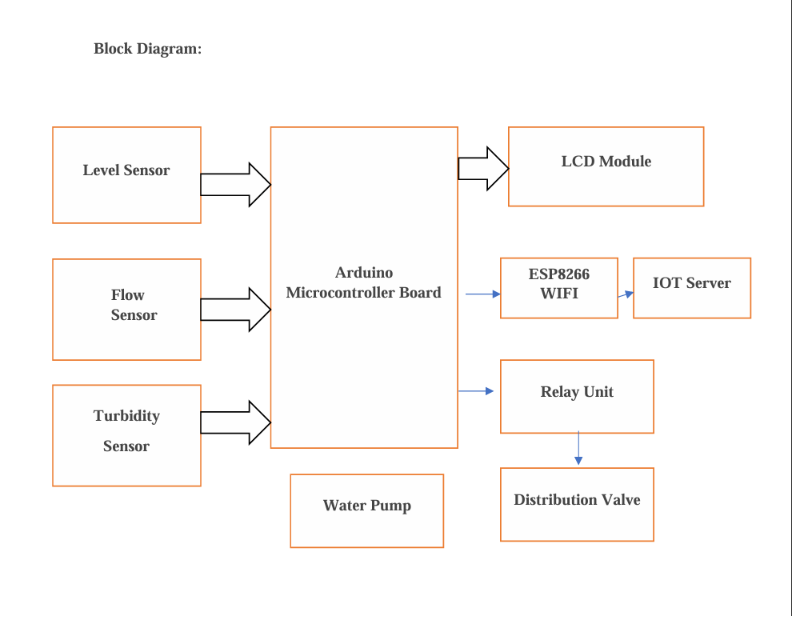
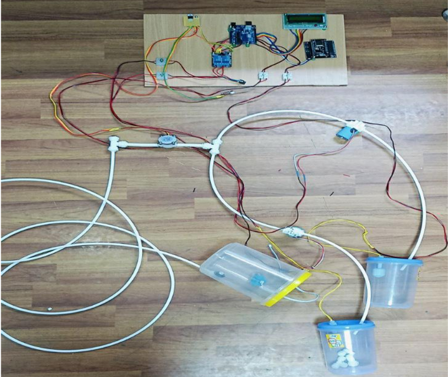

<div align="center">

# 💧 IoT-Based Smart Water Distribution & Quality Monitoring System

### Intelligent Water Management using Arduino Uno, ESP8266 NodeMCU & IoT


</div>

---

# 📖 Overview

The **IoT-Based Smart Water Distribution & Quality Monitoring System** is an embedded solution that automates water distribution while continuously monitoring water quality, flow rate, and tank levels.

Built using **Arduino Uno** and **ESP8266 NodeMCU**, the system collects real-time sensor data, controls water flow through solenoid valves, displays information on an LCD, and transmits data to the **Blynk IoT Platform** for remote monitoring.

---

# ✨ Key Features

- 💧 Real-Time Water Flow Monitoring
- 🌊 Turbidity (Water Quality) Monitoring
- 🛢 Automatic Tank Level Detection
- 🚰 Smart Solenoid Valve Control
- 📟 Live LCD Display
- ☁ IoT-Based Remote Monitoring
- ⚡ Low-Cost Embedded System
- 🔄 Continuous Real-Time Data Updates

---

# 🛠 Hardware Components

| Component | Purpose |
|-----------|---------|
| Arduino Uno | Main Controller |
| ESP8266 NodeMCU | Wi-Fi Communication |
| Water Flow Sensor | Flow Measurement |
| Turbidity Sensor | Water Quality Monitoring |
| Float Switch ×2 | Tank Level Detection |
| Solenoid Valve ×2 | Automatic Water Control |
| 16×2 LCD | Live Status Display |
| Power Supply | System Power |

---

# 💻 Software & Tools

- Arduino IDE
- Embedded C++
- Blynk IoT Platform
- Git & GitHub

---

# 📷 Prototype

<p align="center">

</p>

---

# 🔄 Project Workflow

<p align="center">

</p>

---

# 🏗 System Block Diagram

<p align="center">

</p>

---

# 🔌 Circuit Architecture

<p align="center">

</p>

---

# ⚙ Working Principle

1. Initialize Arduino Uno, LCD, and communication modules.
2. Read turbidity sensor values to determine water quality.
3. Detect tank levels using float switches.
4. Automatically control solenoid valves based on tank status.
5. Measure water flow using the flow sensor.
6. Calculate flow rate and total water consumption.
7. Display sensor values on the LCD.
8. Transmit water quality and flow data to the Blynk IoT Platform through ESP8266.
9. Repeat continuously for real-time monitoring.

---

# 📈 Future Enhancements

- 📱 Android/iOS Mobile Application
- ☁ MQTT Cloud Integration
- 🤖 AI-Based Leakage Detection
- 🧠 TinyML Edge Intelligence
- 📡 LoRa Long-Range Communication
- 📊 Real-Time Analytics Dashboard

---

# 📂 Repository Structure

```
📦 IoT-Enabled-Water-Management-System
│
├── images/
│   ├── prototype.png
│   ├── components.png
│   ├── project_flowchart.png
│   ├── block_diagram.png
│   └── circuit_architecture.png
│
├── Water_Distribution_System.ino
├── Project_Flow.md
├── Working_Principle.md
├── LICENSE
└── README.md
```

---

# 👨‍💻 Author

**Baranidharan S**

- 💼 LinkedIn: https://www.linkedin.com/in/baranidharan-sanmugam-b6a3532a5/
- 💻 GitHub: https://github.com/Baranidharan-Ece
- 📧 Email: baranidharansnkdr@gmail.com

---

## ⭐ Support

If you found this project useful, consider giving it a **⭐ Star** on GitHub.
